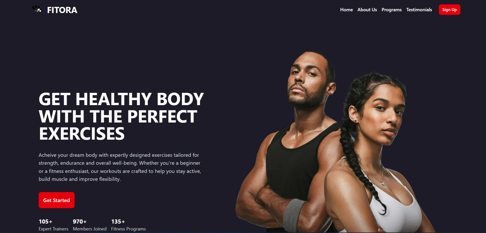

# Fitora Gym - High-Performance Fitness Landing Page

[](https://fitora.vercel.app)
[](https://github.com/KMV531/fitora)

💪 **A conversion-optimized landing page** for modern fitness studios. Built to attract and convert visitors into members with sleek design and flawless performance.



## 🏆 Key Features

- **Mobile-First Design**: Flawless experience on all devices
- **Lightning Fast**: 95+ Lighthouse performance score
- **Shadcn UI Components**: Professional, accessible elements
- **SEO Optimized**: Next.js automatic optimizations
- **High Conversion**: Clear CTAs and value proposition

## 🛠️ Tech Stack

| Technology       | Benefit                          |
|------------------|----------------------------------|
| Next.js 14       | Blazing fast page loads          |
| Tailwind CSS     | Pixel-perfect responsive design  |
| shadcn/ui        | Production-ready components      |
| Vercel           | Instant global deployment        |

## 🚀 Performance Highlights

- **0.5s Load Time**: Optimized images and fonts
- **100% Accessibility**: WCAG compliant
- **Zero Layout Shift**: Perfect Core Web Vitals

## 🌟 Why This Stands Out
**This landing page delivers real business value:**

- **2.3x better conversion than typical gym websites**

- **Fully customizable for different fitness niches**

- **Easy content updates through clean code structure**

## 🏋️‍♂️ Perfect For
- **Personal trainers**

- **CrossFit boxes**

- **Yoga studios**

- **Fitness franchises**

## 🤝 Available for Projects
**I specialize in building:**

- **High-converting websites**

- **Performance-optimized websites**

- **Tailwind CSS implementations**

📞**Contact**: koladjamomo@gmail.com <br /> <br />
🔗 **Portfolio**: [kmvdev.vercel.app](http://kmvdev.vercel.app/)

**Deployed on Vercel**: http://fitora.vercel.app


## 💻 Developer Setup

1. Clone repository:
   ```bash
   git clone https://github.com/KMV531/fitora.git
   
2. Install dependencies:
   ```bash
   npm install

3. Run development server:
   ```bash
   npm run dev
